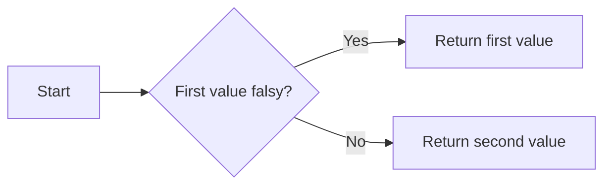
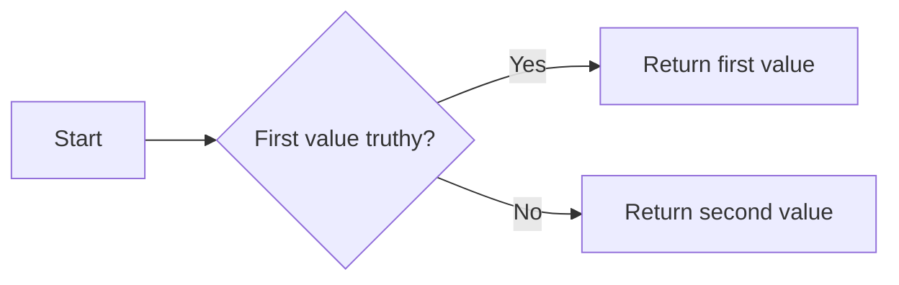

# The `and` & `or` keywords

:::tip Summary of this lecture
The `and` and `or` keywords behave slightly differently than many learners believe. Every value in Python can be turned to a boolean (`True`/`False`), so we say values can be "truthy" or "falsy" based on what boolean they return.

Zero or empty values, such as `0`, `""`, or empty lists and tuples, are "falsy". Almost every other value is "truthy".

The `and` keyword returns the first value if it is falsy. Otherwise it returns the second value. The `or` keyword returns the first value if it is truthy. Otherwise it returns the second value.
:::

## Using `and` & `or` with Boolean values

### The `and` keyword

The `and` and `or` keywords behave _logically_ with Boolean values. If you say "the door is open and the window is closed", everyone understands that both things are true.

Let's say you've asked the user for their age, they've entered 25, and you want to see if the age is **over 18** and **under 65**:

```py
age = 25  # could be int(input("Enter your age: "))

result = age > 18 and age < 65  # True and True
print(result)  # True
```

If we make a change to check the age is **under 18 and over 65**, then we get `False`:

```py
age = 25

result = age < 18 and age > 65  # False and False
print(result)  # False
```

If we do something like `age < 18 and age < 65`, we still get `False` because both conditions aren't `True`. `age < 18` is `False`:

```py
age = 25

result = age < 18 and age < 65  # False and True
print(result)  # False
```

Here's a table of the potential options for the `and` keyword.

| First value | Second value | Operation         | Result  |
| ----------- | ------------ | ----------------- | ------- |
| `True`      | `False`      | `True and False`  | `False` |
| `True`      | `True`       | `True and True`   | `True`  |
| `False`     | `True`       | `False and True`  | `False` |
| `False`     | `False`      | `False and False` | `False` |

Something interesting to note is that the `and` keyword **returns the first value if it is `False`, otherwise it returns the second value**.

This may seem confusing, but it actually simplifies the way the keyword works. For example, here:

```py
age = 25

result = age < 18 and age < 65  # False and ??? doesn't matter
print(result)  # False
```

Python doesn't have to calculate `age < 65` because it knows that the result will be `False`, since `False and anything` is always `False`.

Here's a diagram to help you remember how the `and` keyword works:



### The `or` keyword

The `or` keyword is more or less the opposite!



That's because if the first value is `True`, then it doesn't matter what the second value is, `True or anything` will always be `True`.

For example, let's look at this code:

```py
age = 25

result = age > 18 or age < 65  # True and ??? doesn't matter
print(result)  # True
```

Have a play around with the `and` and `or` keywords, and try out all the different combinations or `True` and `False`!

Here's a table of the `or` keyword:

| First value | Second value | Operation        | Result  |
| ----------- | ------------ | ---------------- | ------- |
| `True`      | `False`      | `True or False`  | `True`  |
| `True`      | `True`       | `True or True`   | `True`  |
| `False`     | `True`       | `False or True`  | `True`  |
| `False`     | `False`      | `False or False` | `False` |

## Using `and` & `or` with non-Boolean values

### Truthy and Falsy values (Truth Value Testing)

In the diagrams earlier I wrote the values must be "truthy" or "falsy". I didn't write `True` and `False` on purpose.

Almost every value in Python can be converted into a Boolean value using the `bool()` function, even if it doesn't seem to make "sense". For example:

```python
bool(0)  # False, zero
bool(13)  # True

bool("")  # False, empty string
bool("Hello")  # True

bool([])  # False, empty list
bool([1, 3, 5])  # True
```

Generally, zero or empty values evaluate to `False` when passed through `bool()`. Non-zero or non-empty values evaluate to `True`. For a more complete list, see the [official documentation](https://docs.python.org/3/library/stdtypes.html#truth-value-testing).

So if you use the `and` or `or` keywords with any value, even if they are not Booleans, the principle still applies.

Here's an example:

```python
default_age = 30
age = 0

user_age = age or default_age
print(user_age)  # 30
```

Since `age` is `0`, and that is a "falsy" value, then `or` returns the second value, which is `30`.

This may not seem very useful just now, but it's actually a super-common pattern. Here's another, more complete example:

```python
default_greeting = "there"
name = input("What's your name? (optional) ")
user_name = name or default_greeting

print(f"Hello, {user_name}!")  # Hello, there or Hello, Bob (example)
```

It's less common to use the `and` keyword in this way, but it can still be done. It's worth knowing about it!

### Examples of `and` and `or` on non-Boolean values

Here are a few questions, see if you can calculate the correct result!

import Tabs from '@theme/Tabs';
import TabItem from '@theme/TabItem';

<div className="codeTabContainer">
<Tabs>
<TabItem value="questions" label="Questions" default>

1. `34 and 10`
1. `0 and "hello"`
1. `10 and "world"`
1. `-3 and 87.5`

</TabItem>
<TabItem value="answers" label="Answers">

1. `34 and 10` ➡️ `34` is truthy, so `and` returns the second value. The result is `10`.
2. `0 and "hello"` ➡️ `0` is falsy, so `and` returns it. The result is `0`.
3. `10 and "world"` ➡️ `10` is truthy, so `and` returns the second value. The result is `"world"`.
4. `-3 and 87.5` ➡️ `-3` is truthy, so `and` returns the second value. The result is `87.5`.

</TabItem>
</Tabs>
</div>
<br/>

And now for the `or` keyword:

<div className="codeTabContainer">
<Tabs>
<TabItem value="questions" label="Questions" default>

1. `None or 35`
2. `0 or "hello"`
3. `10 or "world"`
4. `-3 or 87.5`

</TabItem>
<TabItem value="answers" label="Answers">

1. `None or 35` ➡️ `None` is falsy, so `or` returns the second value. The result is `35`.
2. `0 or "hello"` ➡️ `0` is falsy, so `or` returns the second value. The result is `"hello"`.
3. `10 or "world"` ➡️ `10` is truthy, so `or` returns it. The result is `10`.
4. `-3 or 87.5` ➡️ `-3` is truthy, so `or` returns it. The result is `-3`.

</TabItem>
</Tabs>
</div>
