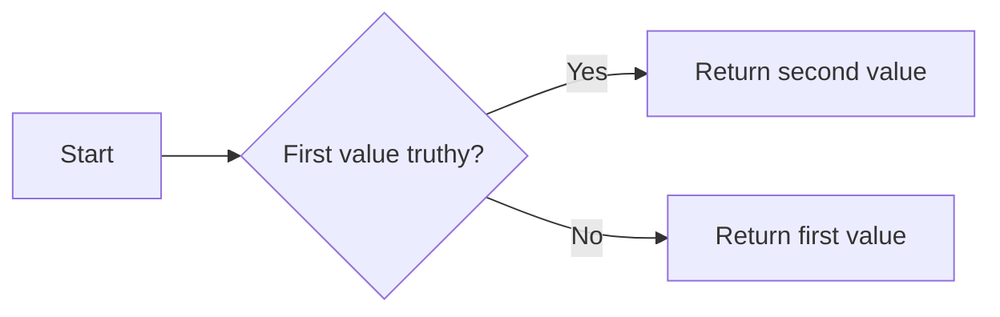
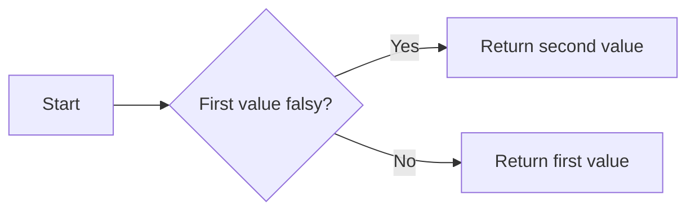

# The `and` & `or` keywords

??? abstract "Summary of this lecture"

    The `and` and `or` keywords behave slightly differently than many learners believe. Every value in Python can be turned to a boolean (`True`/`False`), so we say values can be "truthy" or "falsy" based on what boolean they return.

    Zero or empty values, such as `0`, `""`, or empty lists and tuples, are "falsy". Almost every other value is "truthy".

    The `and` keyword returns the first value if it is falsy. Otherwise it returns the second value. The `or` keyword returns the first value if it is truthy. Otherwise it returns the second value.

## A common misunderstanding

The `and` and `or` keywords are probably the most often-misunderstood keywords in Python. That's because they are often used in boolean logic, and most students assume they can only be used in boolean logic.

Let me explain what I mean with some code!

```py
age = int(input("Enter your age: "))  # (1)
can_learn_programming = age > 0 and age < 150  # (2)

print(f"You can learn programming: {can_learn_programming}")
```

1. Here we ask the user for their age and turn it into an `int`. That's so we can compare it to other numeric values in the next line.
2. Assume the user entered `20`. Then `age > 0` will evaluate to `True`, and `age < 150` will also evaluate to `True`. Then, we can expect `can_learn_programming` to be `True`.

The assumption, which is **incorrect**, is that when the `and` keyword is placed between two `True` values it returns `True`, and in all other cases it returns `False`.

Let's see what happens when we try something different:

```py
age = 60
can_learn_programming = True

result = can_learn_programming and age
print(result)
```

What do you think the result will be?

Try running it in repl.it or your editor of choice!

You can see the result is `60` 🤔 but that seems really strange. How can `True and 60` result in `60`?

That's because the `and` keyword returns the second value if the first one is "truthy" (more on that later). Otherwise, it returns the first value.



Weird, right? Let's try a few combinations:

## Table of evaluations for `and` with `True` and `False`

| First value | Second value | Operation         | Result  |
| ----------- | ------------ | ----------------- | ------- |
| `True`      | `False`      | `True and False`  | `False` |
| `True`      | `True`       | `True and True`   | `True`  |
| `False`     | `True`       | `False and True`  | `False` |
| `False`     | `False`      | `False and False` | `False` |

You can see that in every case with these booleans, when the first value was `True`, the second value was returned by the `and` operation. When the first value was `False`, then _it_ was returned.

## Truth value testing in Python

What happens when we start combining other values? Let's make a couple more tables:

| First value | Second value | Operation         | Result  |
| ----------- | ------------ | ----------------- | ------- |
| `56`        | `False`      | `56 and False`    | `False` |
| `1`         | `34`         | `1 and 34`        | `1`     |
| `False`     | `54`         | `False and 54`    | `False` |
| `False`     | `False`      | `False and False` | `False` |

And this one:

| First value | Second value | Operation       | Result |
| ----------- | ------------ | --------------- | ------ |
| `True`      | `0`          | `True and 0`    | `0`    |
| `True`      | `True`       | `True and True` | `True` |
| `0`         | `True`       | `0 and True`    | `0`    |
| `0`         | `0`          | `0 and 0`       | `0`    |

So from this we can tell that the number `0` is equivalent to `False` when it comes to the `and` keyword. And positive numbers are equivalent to `True`.

This has a name in Python: **truth value testing**. Every value in Python can be converted into a boolean, and depending on what the value is, you'll get either `True` or `False`.

We convert values to booleans using the `bool()` function:

```py
value = 0
converted = bool(value)
print(converted)  # False
```

```py
value = 1
converted = bool(value)
print(converted)  # True
```

It's not difficult to remember which values will evaluate to `False`, and it's easy enough to check (just by running code like the one just above!).

The values that evaluate to `False` when passed through `bool()` are empty / zero values, such as:

- Empty strings, `""`.
- Empty lists, tuples, dictionaries, or sets, `[]`, `()`, `{}`, `set()`.
- The number `0` (and its equivalents)
- The constants `None` and `False`.

We call these values "falsy" since we can treat them as `False` for the purposes of boolean comparisons. Values that would evaluate to `True` are called "truthy".

For a more complete list, see the [official documentation](https://docs.python.org/3/library/stdtypes.html#truth-value-testing).

With this, you'll be able to easily tell what the result of these operations will be:

<div class="annotate" markdown>

- `34 and 10` (1)
- `0 and "hello"` (2)
- `10 and "world"` (3)
- `-3 and 87.5` (4)

</div>

1. `34` is truthy, so `and` returns the second value. The result is `10`.
2. `0` is falsy, so `and` returns it. The result is `0`.
3. `10` is truthy, so `and` returns the second value. The result is `"world"`.
4. `-3` is truthy, so `and` returns the second value. The result is `87.5`.

## The `or` keyword in Python.

Now that you know how `and` works, learning how `or` works is a piece of cake!

`or` returns the first value if it is truthy, otherwise it returns the second value. The opposite of `and`!



Try to figure out what these operations would return:

<div class="annotate" markdown>

- `None or 35` (1)
- `0 or "hello"` (2)
- `10 or "world"` (3)
- `-3 or 87.5` (4)

</div>

1. `None` is falsy, so `or` returns the second value. The result is `35`.
2. `0` is falsy, so `or` returns the second value. The result is `"hello"`.
3. `10` is truthy, so `or` returns it. The result is `10`.
4. `-3` is truthy, so `or` returns it. The result is `-3`.

## Table of evaluations for `or` with `True` and `False`

The traditional truth table for `or` also follows this principle:

| First value | Second value | Operation        | Result  |
| ----------- | ------------ | ---------------- | ------- |
| `True`      | `False`      | `True or False`  | `True`  |
| `True`      | `True`       | `True or True`   | `True`  |
| `False`     | `True`       | `False or True`  | `True`  |
| `False`     | `False`      | `False or False` | `False` |

In every case where the first value was truthy, it was returned. If it wasn't, then the second value was returned.
